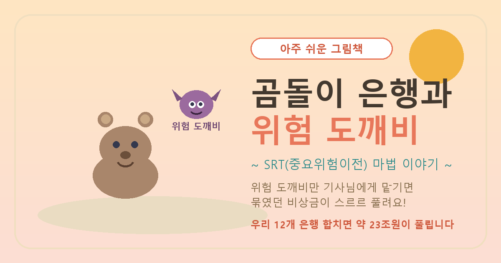

# 🐻 곰돌이 은행과 위험 도깨비 — 아주 쉬운 그림책

> SRT(중요위험이전, Significant Risk Transfer)를 **아이도 이해하는 그림책 동화**로 풀었습니다.
> (어른용 논문이 나오기 전, 이야기로 먼저 만나보세요.)

## 🌐 보기 / 공유

- 그림책 보기: **https://sdkparkforbi.github.io/srt-fairytale/**
- 카카오톡 등에 위 링크를 붙여넣으면 썸네일·제목이 미리보기로 떠요(Open Graph 적용).

## 📖 이야기 한 줄 요약

은행(곰돌이)은 위험한 대출을 할수록 비상금(자본)을 많이 묶어둬야 해요.
대출 속 **가장 위험한 부분(위험 도깨비)** 만 투자자(기사님)에게 맡기면(보험처럼),
묶였던 비상금이 풀려 **더 많이 대출**하고 **은행도 튼튼해집니다.**

## 🔑 비유 풀이

| 동화 속 | 진짜 뜻 |
|---|---|
| 곰돌이 | 은행 |
| 위험 도깨비 | 대출의 위험(신용위험) |
| 비상금 | 자본(위험가중자산에 대비) |
| 기사님 | 투자자 |
| 작은 선물(수수료) | 보증수수료 |
| 부엉이 박사 | 연구자 |
| 23조원 / 더 튼튼 | 12개 은행 합산 위험가중자산 경감액 / 보통주자본(CET1)비율 평균 +3.2%p |

> ⚠️ 안전한 대출(집담보)엔 도깨비가 없어 마법이 필요 없어요 → 위험가중치가 낮은 주택담보는 효과가 없어 제외, 기업대출 위주로만 적용합니다.

---

🤖 생성형 AI 협업 제작 · 2026 · 다음 편: 어른용 연구 논문
